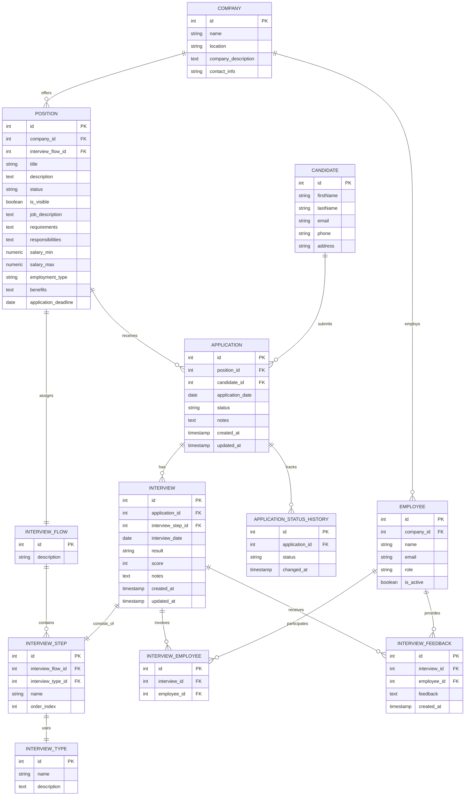

```mermaid
erDiagram
     COMPANY {
         int id PK
         string name
         string location
         text company_description
         string contact_info
     }
     EMPLOYEE {
         int id PK
         int company_id FK
         string name
         string email
         string role
         boolean is_active
     }
     POSITION {
         int id PK
         int company_id FK
         int interview_flow_id FK
         string title
         text description
         string status
         boolean is_visible
         text job_description
         text requirements
         text responsibilities
         numeric salary_min
         numeric salary_max
         string employment_type
         text benefits
         date application_deadline
     }
     INTERVIEW_FLOW {
         int id PK
         string description
     }
     INTERVIEW_STEP {
         int id PK
         int interview_flow_id FK
         int interview_type_id FK
         string name
         int order_index
     }
     INTERVIEW_TYPE {
         int id PK
         string name
         text description
     }
     CANDIDATE {
         int id PK
         string firstName
         string lastName
         string email
         string phone
         string address
     }
     APPLICATION {
         int id PK
         int position_id FK
         int candidate_id FK
         date application_date
         string status
         text notes
         timestamp created_at
         timestamp updated_at
     }
     APPLICATION_STATUS_HISTORY {
         int id PK
         int application_id FK
         string status
         timestamp changed_at
     }
     INTERVIEW {
         int id PK
         int application_id FK
         int interview_step_id FK
         date interview_date
         string result
         int score
         text notes
         timestamp created_at
         timestamp updated_at
     }
     INTERVIEW_EMPLOYEE {
         int id PK
         int interview_id FK
         int employee_id FK
     }
     INTERVIEW_FEEDBACK {
         int id PK
         int interview_id FK
         int employee_id FK
         text feedback
         timestamp created_at
     }

     COMPANY ||--o{ EMPLOYEE : employs
     COMPANY ||--o{ POSITION : offers
     POSITION ||--|| INTERVIEW_FLOW : assigns
     INTERVIEW_FLOW ||--o{ INTERVIEW_STEP : contains
     INTERVIEW_STEP ||--|| INTERVIEW_TYPE : uses
     POSITION ||--o{ APPLICATION : receives
     CANDIDATE ||--o{ APPLICATION : submits
     APPLICATION ||--o{ INTERVIEW : has
     APPLICATION ||--o{ APPLICATION_STATUS_HISTORY : tracks
     INTERVIEW ||--|| INTERVIEW_STEP : consists_of
     INTERVIEW ||--o{ INTERVIEW_EMPLOYEE : involves
     INTERVIEW ||--o{ INTERVIEW_FEEDBACK : receives
     EMPLOYEE ||--o{ INTERVIEW_EMPLOYEE : participates
     EMPLOYEE ||--o{ INTERVIEW_FEEDBACK : provides
```